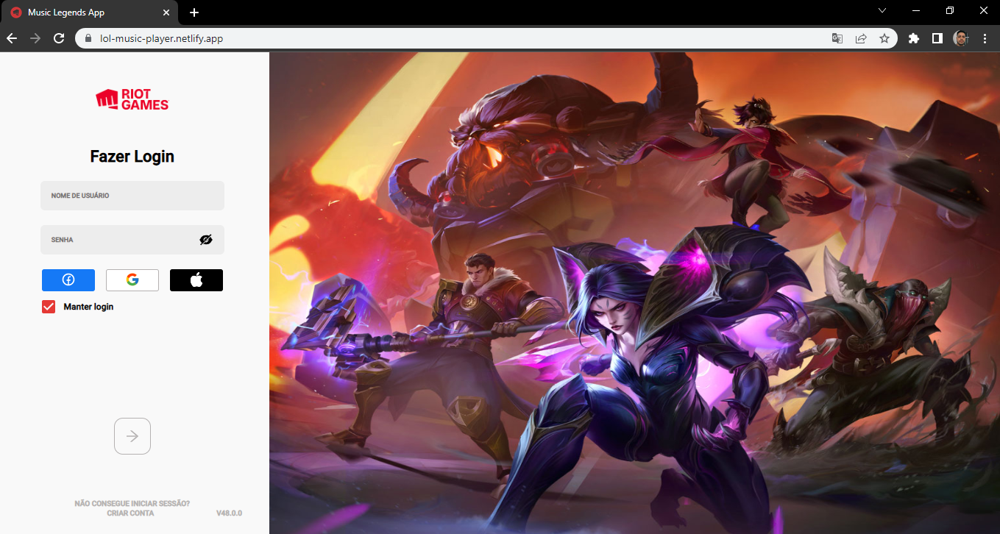
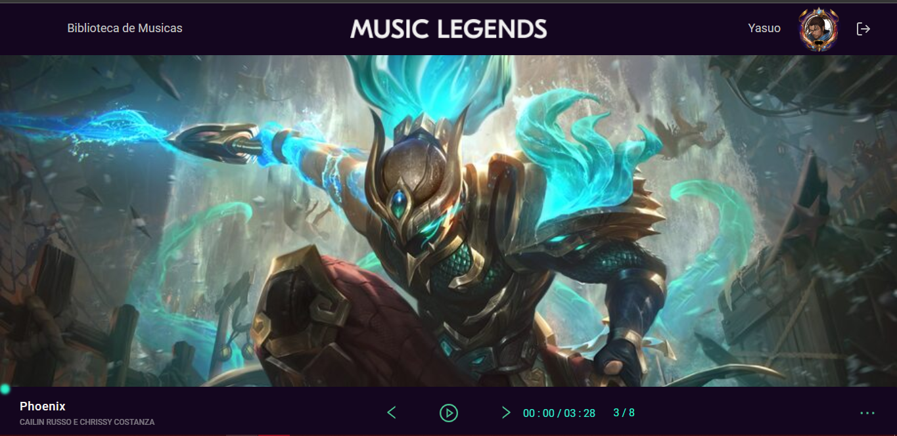
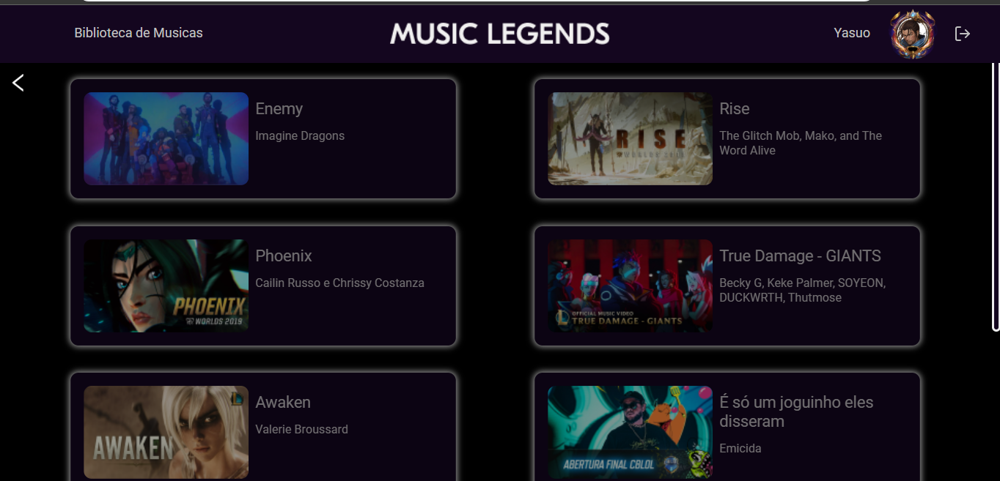

# League of Legends Music Player



> O Projeto é um media player com tema de League of Legends.

Confira a aplicação: https://lol-music-player.netlify.app


## 📄 Explicação

A primeira página do projeto é a de login que apresenta um campo de email e senha. Os dois campos devem ser preenchidos para habilitar o botão de logar igual é feito na tela inicial do jogo League of Legends.

Logo após efetuar login, você é redirecionado para a página Media Player com um belo recebimento de Boas Vindas de ninguem mais ninguem menos do que Draaaaaaaveeeeen ! 😎.

O nickname utilizado é apresentado no Header da aplicação com um sistema de troca de imagem de perfil, você pode selecionar o personagem que mais lhe agrada aquele que está dentro do seu coração ❤.

Você tem opções padrões de um Media Player: Pause, Start e troca de música.

Clicando no botão de "3 pontinhos" ira abrir a playlist listando as músicas pré definidas no sistema.
(Pra mim as melhores músicas).

- Enemy (Imagine Dragons)
- Rise: (The Glitch Mob, Mako, and The Word Alive)
- Phoenix Cailin Russo e Chrissy Costanza
- True Damage: GIANTS (Becky G, Keke Palmer, SOYEON, DUCKWRTH, Thutmose)
- Awaken (Valerie Broussard)
- É só um joguinho eles disseram (Emicida)
- KDA - POP STARS (Madison Beer, (G)I-DLE, Jaira Burns)
- Legends Never Die (Against The Current)
    
## 📁 Seções

O site é composto por 3 seções diferentes:

* **Login:** É uma copia do sistema de login do jogo.
* **Media Player:** Tela para execução das músicas.
* **Lista de Músicas:** Tela para exibição da playlist.

## 🎯 Etapas

✔️ Projeto base;\
✔️ Criação das rotas;\
✔️ Página Home;\
✔️ Profile image;\
✔️ Voz Draven ao logar;\
✔️ Criação Media Player;\
✔️ Criação PlayList;\
✔️ Finalizado;

## 🚀 Tecnologias

Neste projeto foram utilizadas as seguintes ferramentas:

* [ReactJs](https://pt-br.reactjs.org/)
* [Toast](https://fkhadra.github.io/react-toastify/introduction/)
* [Material UI](https://mui.com/pt/material-ui/getting-started/installation/)
* [LocalStorage](https://developer.mozilla.org/pt-BR/docs/Web/API/Window/localStorage)
* [Carousel](https://www.npmjs.com/package/react-multi-carousel)
* [React Icon](https://react-icons.github.io/react-icons/)
* [Styled-Components](https://styled-components.com)

## 📕 Requisitos

Antes de iniciar 🏁, você precisa ter [Git](https://git-scm.com/) e [Node](https://nodejs.org/en/) instalados.

## 🏁 Iniciando

```bash
# Clone this project
$ git clone https://github.com/Dev-Pedrosv/lol-media-player.git
# Access
$ cd lol-media-player
# Install dependencies
$ yarn or npm 
# Run the project
$ yarn start or npm start 
# The server will initialize in the <http://localhost:3000>
```

## 🤝 Colaboradores

Agradecemos às seguintes pessoas que contribuíram para este projeto:

<table>
  <tr>
    <td align="center">
      <a href="#">
        <br>
        <sub>
          <b>Pedro Silva</b>
        </sub>
      </a>
    </td>
  </tr>
</table>

## 📝 Licença

Este projeto está sob licença. Consulte o arquivo [LICENSE](LICENSE.md) para obter mais detalhes.

&#xa0;

<a href="#top">Volte para o Topo</a>

